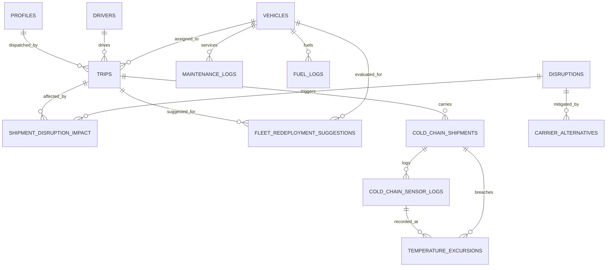

# SupplyShield L2 — Architecture & System Design

---

## 1. End-to-End System Architecture

The following Mermaid diagram illustrates the end-to-end architecture of SupplyShield L2, demonstrating how **IBM Bob**, the **Model Context Protocol (MCP) Server**, the **Next.js 16 Full-Stack Application**, and the **Supabase PostgreSQL Database** interact:

```mermaid
graph TB
    subgraph ClientLayer ["Client & Agent Interface Layer"]
        BobCLI["IBM Bob CLI / Agent<br/>(External Developer / Operations CLI)"]
        WebUI["Next.js 16 Web Dashboard UI<br/>(React 19 + Recharts + Lucide Icons)"]
        BobDrawer["Ask Bob AI Assistant Drawer<br/>(In-App Operational Triage Interface)"]
    end

    subgraph IntegrationLayer ["Integration & Protocol Layer"]
        MCPServer["IBM Bob MCP Server<br/>(src/mcp/server.js via @modelcontextprotocol/sdk)"]
        StdioTransport["Stdio Transport (JSON-RPC 2.0)<br/>(src/mcp/cli.js)"]
        APIRoute["Next.js API Handler<br/>(src/app/api/bob/chat/route.js)"]
        MCPTools["13 Operational Supply Chain Tools<br/>(src/mcp/tools.js)"]
    end

    subgraph EngineLayer ["Deterministic Business Logic Engines"]
        DE["Disruption Impact Engine<br/>(Region Corridor Matching & Severity Matrix)"]
        CCE["Cold Chain Telemetry Engine<br/>(Threshold Breach & Excursion Classifier)"]
        ROE["Fleet Redeployment Optimizer<br/>(Multi-Factor Idle Priority Scoring 0-100)"]
    end

    subgraph BackendLayer ["Supabase Enterprise Data Layer"]
        Auth["Supabase GoTrue Auth<br/>(Role-Based Access Control: 4 Roles)"]
        Realtime["Realtime WebSocket Channels<br/>(postgres_changes CDC Replication)"]
        Postgres[(PostgreSQL 15+ Database<br/>Core Tables + L2 Relational Schema)]
    end

    %% External Agent Connection
    BobCLI <-->|JSON-RPC Stdio| StdioTransport
    StdioTransport <--> MCPServer
    MCPServer --> MCPTools

    %% Web UI Connection
    WebUI --> BobDrawer
    BobDrawer <-->|HTTP POST JSON| APIRoute
    APIRoute --> MCPTools

    %% Tools Call Engines & Database
    MCPTools --> DE
    MCPTools --> CCE
    MCPTools --> ROE
    MCPTools <-->|@supabase/supabase-js| Postgres

    %% Web UI Direct Data Access
    WebUI <-->|WebSockets| Realtime
    WebUI <-->|REST / RLS| Postgres
    WebUI --> Auth
    Realtime <--> Postgres

    %% Style Subgraphs
    classDef clientStyle fill:#eff6ff,stroke:#3b82f6,stroke-width:2px;
    classDef mcpStyle fill:#f0fdf4,stroke:#22c55e,stroke-width:2px;
    classDef engineStyle fill:#fefce8,stroke:#eab308,stroke-width:2px;
    classDef dbStyle fill:#faf5ff,stroke:#a855f7,stroke-width:2px;

    class ClientLayer clientStyle;
    class IntegrationLayer mcpStyle;
    class EngineLayer engineStyle;
    class BackendLayer dbStyle;
```

---

## 2. Database Entity-Relationship (ER) Architecture



---

## 3. System Component Responsibility Matrix

| Component | Technology | Responsibility |
|---|---|---|
| **Frontend UI** | Next.js 16 (App Router), React 19, Vanilla CSS & Tailwind CSS 4 | Responsive command center, KPI dashboards, telemetry graphs, and modal workflows |
| **IBM Bob Assistant Drawer** | React 19, Lucide Icons, Custom CSS | Interactive slide-out drawer providing in-app Bob AI interaction with live tool execution traces |
| **IBM Bob MCP Server** | `@modelcontextprotocol/sdk`, Node.js ES Modules | Implements JSON-RPC 2.0 stdio server exposing 13 live operational tools to external AI clients |
| **API Router** | Next.js Route Handler (`/api/bob/chat`) | Bridges browser assistant interactions to server-side MCP tool execution and reasoning |
| **MCP Operational Tools** | JavaScript (`src/mcp/tools.js`) | Connects MCP requests to Supabase tables, executes business logic, and enforces safety safeguards |
| **Disruption Engine** | JavaScript (`src/lib/disruption-engine.js`) | Deterministic corridor intersection matching, severity-based impact grading, and rerouting logic |
| **Cold Chain Engine** | JavaScript (`src/lib/cold-chain-engine.js`) | Evaluates IoT telemetry against regulatory thresholds (WHO PQS, FDA 21 CFR Part 11) and classifies severity |
| **Redeployment Engine** | JavaScript (`src/lib/disruption-engine.js`) | Multi-factor optimization scoring (0–100) balancing asset idle hours against regional freight demand |
| **Relational Database** | Supabase (PostgreSQL 15+) | Persistent relational storage across 13 tables, indexing, and Row-Level Security (RLS) policies |
| **Realtime Engine** | Supabase Realtime WebSockets | Pushes live database changes (`postgres_changes`) to client views without polling |
| **Authentication & RBAC** | Supabase GoTrue Auth | Secure JWT session cookie validation, enforcing granular permissions across 4 operational roles |

---

## 4. End-to-End Data Movement

### Flow A: IBM Bob Disruption Triage & Corridor Rerouting
```text
[External Disruption Alert / User Prompt]
   ↓
IBM Bob (via MCP Tool: "analyze_disruption")
   ↓
MCP Server (src/mcp/server.js)
   ↓
Query Active Disruption & Dispatched Trips from PostgreSQL
   ↓
Disruption Engine (computeImpactLevel + computeRecommendedAction)
   ↓
Formulate Actionable Rationale ("Reroute via Hub 2 bypassing West corridor")
   ↓
Store Impact Record in "shipment_disruption_impact"
   ↓
Dispatcher Reviews & Clicks "Accept Action"
   ↓
PostgreSQL Trip Manifest Updated & Realtime Broadcast Dispatched to Driver
```

### Flow B: Real-Time Cold Chain Telemetry & Excursion Classification
```text
[Reefer IoT Gateway Sensor Reading (Temp: 14.8°C, Humidity: 62%)]
   ↓
Insert into "cold_chain_sensor_logs"
   ↓
Cold Chain Engine Evaluates Reading Against Shipment Manifest Bounds (2°C to 8°C)
   ↓
Calculate Deviation (+6.8°C) & Query Historical Logs to Estimate Breach Duration (35 min)
   ↓
Classify Severity: "REGULATORY_VIOLATION" (Exceeds WHO PQS Vaccine Limits)
   ↓
Insert Excursion Incident into "temperature_excursions" & Mark Shipment "COMPROMISED"
   ↓
Supabase Realtime Pushes High-Priority Warning Toast to Safety Officer
   ↓
IBM Bob Assistant Surfaces Incident Details with Depot Diversion Protocol
```

### Flow C: Fleet Utilisation & Asset Redeployment Scoring
```text
[Dispatcher Opens Redeployment Optimizer or Queries Bob: "Find idle assets"]
   ↓
Execute MCP Tool: "get_idle_fleet_assets"
   ↓
Query Vehicles with Status = "Available" & Calculate Elapsed Idle Hours Since Last Trip
   ↓
Query Active Regional Disruption Density
   ↓
Redeployment Engine Computes Score (0–100): Idle Duration + Disruption Pressure + Capacity
   ↓
Rank Available Assets Descending by Urgency
   ↓
Dispatcher Selects Top-Ranked Asset → System Pre-populates One-Click Draft Trip Dispatch
```

---

## 5. Security & Access Control Architecture

### Granular Role-Based Access Control (RBAC)
The application enforces strict Route and Table access control across four operational personas:

| Role | Allowed Routes | Write Permissions |
|---|---|---|
| **Fleet Manager** | `/`, `/vehicles`, `/drivers`, `/trips`, `/maintenance`, `/fuel`, `/analytics`, `/disruptions`, `/redeployment`, `/cold-chain` | Full administrative CRUD across all fleet and supply chain modules |
| **Dispatcher** | `/`, `/vehicles`, `/trips`, `/disruptions` | Trip dispatch, payload validation, disruption mitigation acceptance |
| **Safety Officer** | `/`, `/drivers`, `/maintenance`, `/cold-chain` | Driver safety compliance, maintenance verification, cold chain excursion sign-offs |
| **Financial Analyst** | `/`, `/fuel`, `/analytics` | Fuel purchase logging, efficiency metrics, operational ROI reports |

### Operational Safeguards
1. **No Silent State Changes:** High-impact operations (rerouting shipments, reassigning freight carriers, redeploying assets) default to advisory recommendations requiring authenticated operator confirmation.
2. **Credential Isolation:** All API keys (`NEXT_PUBLIC_SUPABASE_ANON_KEY`, `SUPABASE_SERVICE_ROLE_KEY`, `WATSONX_API_KEY`) are managed via environment variables and never exposed to client bundles.
3. **Database RLS:** Row-Level Security policies in PostgreSQL guarantee data protection at the database engine level.
