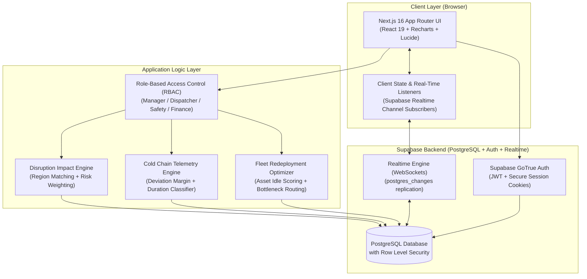
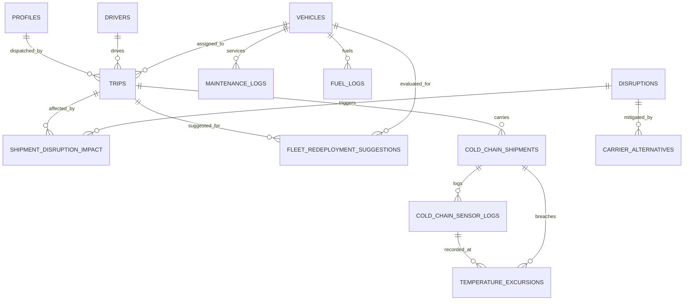

# FleetFlow Architecture & System Design

FleetFlow is an enterprise-grade, real-time fleet operations and logistics management platform extended with the **L2 Supply Chain Disruption Assistant & Cold Chain Optimization Engine**.

---

## 1. System Architecture Diagram

---

## 2. Database Entity-Relationship Architecture

---

## 3. Component Breakdown & Responsibilities

| Layer / Component | Technology | Core Responsibility |
|---|---|---|
| **Frontend UI** | Next.js 16, React 19, Vanilla CSS & Tailwind CSS 4 | Responsive command center, KPI dashboards, modal workflows, sensor telemetry graphs |
| **Data Visualization** | Recharts | Live temperature curves with upper/lower regulatory limits, fleet status bar charts, driver availability donuts |
| **Disruption Engine** | JavaScript (`src/lib/disruption-engine.js`) | Rule-based geospatial/corridor matching, severity-based impact level classification (`low`, `medium`, `high`, `blocked`), and recommendation generation (`reroute`, `delay`, `reassign_carrier`, `no_action`) |
| **Cold Chain Engine** | JavaScript (`src/lib/cold-chain-engine.js`) | Continuous IoT reading threshold evaluation, cumulative duration tracking, excursion severity grading (`minor`, `major`, `critical`, `regulatory_violation`), and cargo compromise flagging |
| **Redeployment Engine** | JavaScript (`src/lib/disruption-engine.js`) | Multi-variable optimization scoring (idle duration + corridor disruption pressure + capacity class) |
| **Database & Auth** | Supabase (PostgreSQL 15+) | Relational persistence, Row-Level Security (RLS), ACID transactions, and WebSocket change data capture (CDC) |

---

## 4. End-to-End Data Flows

### A. Disruption Impact & Dynamic Rerouting Flow
1. Fleet manager or external advisory records an active disruption (e.g. Typhoon or Port Strike) with an affected region.
2. The **Disruption Engine** queries active trips (`Draft` or `Dispatched`) intersecting the corridor.
3. Impact levels are calculated using severity matrices (e.g., critical disruptions elevate dispatched trips to `blocked`).
4. Actionable recommendations (`reroute`, `delay`, `reassign_carrier`) are generated and stored in `shipment_disruption_impact`.
5. Dispatcher clicks **Accept Recommendation** → the system updates the linked trip note, reassigns destination/vehicle, and notifies dispatch.

### B. Cold Chain Telemetry & Automated Excursion Flow
1. IoT gateway transmits temperature, humidity, and GPS coordinates to `cold_chain_sensor_logs`.
2. The **Cold Chain Engine** fetches shipment bounds (e.g., +2°C to +8°C for Vaccines).
3. If temperature breaches bounds:
   - Evaluates past logs to determine cumulative duration in breach.
   - For regulated pharma/vaccine cargo: deviation > 3°C or duration > 30 min triggers **Regulatory Violation**.
   - If deviation > 5°C or duration > 60 min, flags as **Critical** and automatically marks the shipment as `compromised`.
4. The system logs an incident in `temperature_excursions` with automated compliance notes.
5. Realtime channels push alerts to the Safety Officer for immediate intervention and sign-off.

---

## 5. Security & Access Control (RBAC)

The application enforces strict Route and Table access control across four operational roles:

| Role | Allowed Routes | Write Permissions |
|---|---|---|
| **Fleet Manager** | `/`, `/vehicles`, `/drivers`, `/trips`, `/maintenance`, `/fuel`, `/analytics`, `/disruptions`, `/redeployment`, `/cold-chain` | Full CRUD across all fleet and supply chain modules |
| **Dispatcher** | `/`, `/vehicles`, `/trips`, `/disruptions` | Trip dispatch, route updates, disruption mitigation acceptance |
| **Safety Officer** | `/`, `/drivers`, `/maintenance`, `/cold-chain` | Driver compliance, vehicle maintenance verification, cold chain excursion sign-offs |
| **Financial Analyst**| `/`, `/fuel`, `/analytics` | Fuel cost logging, operational ROI, expense reports |

Row-Level Security (RLS) policies in PostgreSQL safeguard database operations, ensuring authenticated access across tables with role verification.
